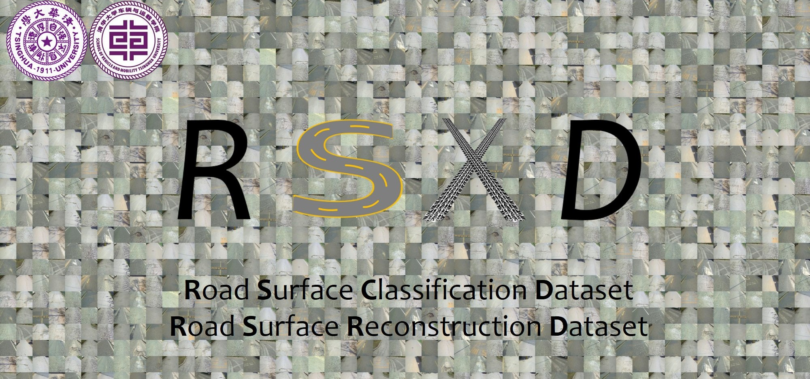
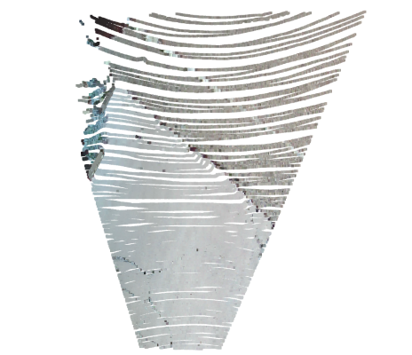

## Please refer to 'dataset description.pdf' for the data format.

## projection.py

This script provides functions for reading calibration parameters, projecting point cloud onto camera and generating depth/disparity maps.

First, set the path and read the corresponding calibration params:
```angular2html
image_path = 'XXX/train/2023-04-08-02-33-11/left/20230408023909.400.jpg'
pcd_path = 'XXX/train/2023-04-08-02-33-11/pcd/20230408023909.400.pcd'
calib_params = read_calib_params('XXX/calib_20230408.pkl')  # the calib file should be determined according to the date.

# Since the images are already rectified, stereo baseline, camera intrinsic, and lidar to camera extrinsic are all you need.
print('intrinsics after rectification:', calib_params["K"])
print('stereo baseline:', calib_params["B"])
print('lidar to left camera rotation:', calib_params["R"])
print('lidar to left camera translation:', calib_params["T"])
```
Read image and pcd files:
```angular2html
image =  cv2.cvtColor(cv2.imread(image_path), cv2.COLOR_BGR2RGB)
cloud = o3d.io.read_point_cloud(pcd_path)
cloud = np.asarray(cloud.points)
```
Then, project the points onto the image plane and obtain the depth/disparity maps:
```angular2html
uv, depth_uv = project_point2camera(calib_params, cloud)
dis_map, depth_map = get_dis_depth_map(uv, depth_uv, calib_params)
```

Visualization:
```angular2html
show_image_with_points(uv, depth_uv, image)
show_clouds_with_color(image, depth_map, calib_params)
```





## read_imu_rtk.py
This script reads the raw position, pose, and velocity measurements of the continuous sequence. Researchers can convert them to the relative pose of LiDAR or camera.
The detailed definitions of the data are available in the dataset description file. 

Read the `.pkl` file:
```angular2html
file_path = 'XXX/train/2023-04-08-02-33-11-1-conti/loc_pose_vel.pkl'
with open(file_path, 'rb') as f:
    loc_pose_vel = pickle.load(f)
```
The `loc_pose_vel` is a list consists of dicts:
```angular2html
[{'time': '20230409021809.400', 'lon': 120.0941255, 'lat': 36.1413406, 'alt': 15009.0, 'vel_e': -4000.0, 'vel_n': 36.0, 'yaw': 90.99, 'roll': 0.02, 'pitch': 17.54}
 {'time': '20230409021809.600', ...}
  ...
]
```

The `lon/lat/alt` position can be converted to the relative motion in ENU coordinate:
```angular2html
lat_origin = loc_pose_vel[0]["lat"]
lon_origin = loc_pose_vel[0]["lon"]
alt_origin = loc_pose_vel[0]["alt"]/1000  # mm --> m
e, n, u = lla_to_enu(loc_pose_vel[4]["lat"], loc_pose_vel[4]["lon"], loc_pose_vel[4]["alt"]/1000, lat_origin, lon_origin, alt_origin)
```
## cam_extrinsic.py
This script calculate the camera extricsic `[R|T]` between two nearby frames.
Here we take the first as origin, calculate the camera extrinsic of current-->origin 

```angular2html
current = loc_pose_vel[4]
reference = loc_pose_vel[0]
extrinsic = Extrinsic(is_half=True)  # is_half=True for the half-resolution subset
R_equ, T_equ = extrinsic.get_cam_extr(current, reference)
```

The point (x,y,z) in the current camera's coordinate can be represented under the origin coordinate.
Researchers can also get the other forms such as Euler angle and quaternion.

```angular2html
p_cur = [1, 1, 1]
p_ori = np.matmul(R_equ, p_cur) + T_equ
```
